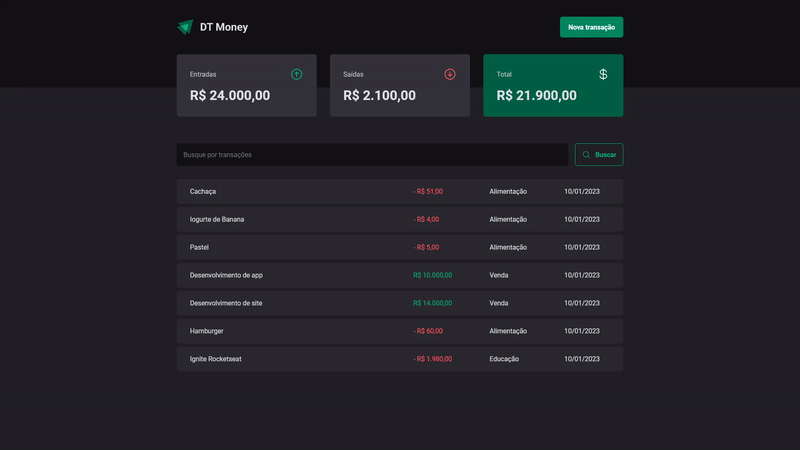

<p align="center">
  
</p>

# [DT Money](https://dt-money-legeannd.vercel.app/)
    

<p align="center">
  
</p>


* [Content (en-US)](#section-en_us)
* [Conteúdo (pt-BR)](#secao-pt_br)

---

## About the project <a id="section-en_us"></a>

This is a personal finances app created in React and Typescript where the user can add all of its incomes and outcomes to track their money behavior. The app uses Radix to create form and modal components and JSON Server to create a mocked API accessed by Axios that the app can use to search and create transactions.

## Content
  * [Techs](#techs)
  * [How to run the project](#installation)
    * [Installation - Frontend](#installation-front)

## Techs <a id="techs"></a>

- [x] React Query
- [x] React Router DOM
- [x] Immer
- [x] Styled Components

## How to execute the project <a id="installation"></a>
To execute the project, you'll need to have Node and NPM or Yarn installed to setup all the dependencies.


### Installation - Front-end (Web) <a id="installation-front"></a>

In the project root folder:

```bash
npm install
npm run dev
npm run dev:server
```

If you are using Yarn, use this:
```bash
yarn install
yarn dev
yarn dev:server
```

<!-- Remember to create a .env file to put the enviroment variables exemplified in the .env.example file with your personal data. -->

After finishing installation, the web page will be open in your browser.

---

## Sobre o projeto <a id="secao-pt_br"></a>

Este é um aplicativo de finanças pessoais criado em React e Typescript, onde o usuário pode adicionar todas as suas entradas e saídas para rastrear seu comportamento financeiro. O aplicativo usa Radix para criar componentes modais e de formulário e JSON Server para criar uma API simulada acessada pelo Axios que o aplicativo pode usar para pesquisar e criar transações.

## Conteúdos
  * [Tecnologias](#tecnlogias)
  * [Como executar o projeto](#instalacao)
    * [Instalação - Front-end](#instalacao-front)

## Tecnologias <a id="tecnologias"></a>

- [x] Radix UI
- [x] React Hook Form
- [x] Styled Components

## Como executar o projeto <a id="instalacao"></a>
Para executar o projeto, você irá precisar ter o Node e o NPM ou Yarn instalados para baixar as dependências.


### Instalação - Front-end (Web) <a id="instalacao-front"></a>

Na pasta raíz do repositório:

```bash
npm install
npm run dev
npm run dev:server
```

Se estiver usando Yarn, utilize
```bash
yarn install
yarn dev
yarn dev:server
```

<!-- Lembre-se de criar um arquivo .env para colocar as variáveis de ambiente exemplificadas no arquivo .env.example com os seus dados pessoais. -->

Quando terminar, a página da aplicação web será aberta no navegador.

---
###### Developed by [Gean Lucas](https://www.linkedin.com/in/geanlucaas/) :rocket:.